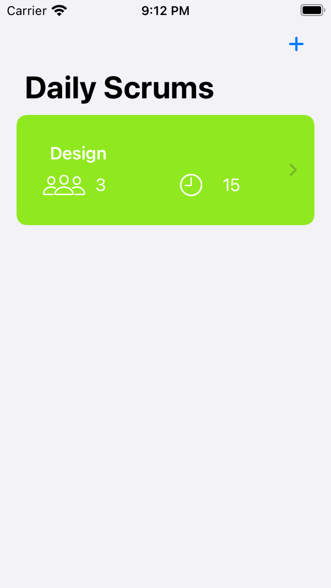
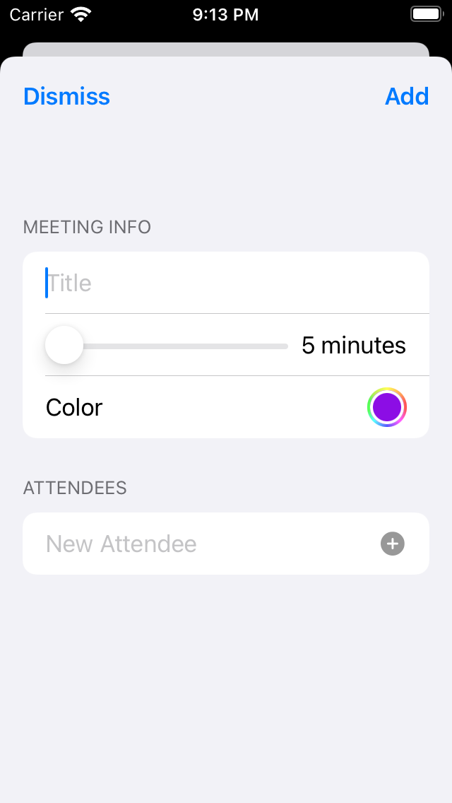
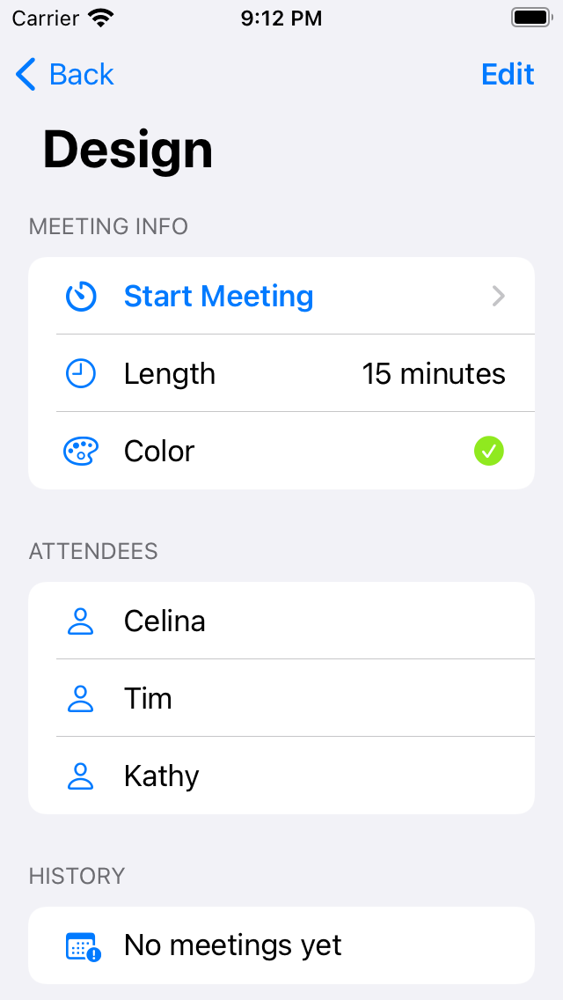
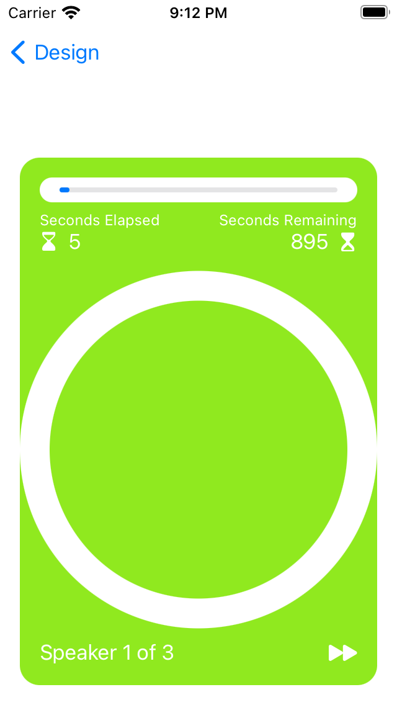

# Hack Technology / Project Attempted

## What you built? 

I followed an Apple tutorial to build a basic iOS app that helps suers manage their daily scrums. You can add meetings, edit meeting details, start timers, and more. There are also some accessibility components, such as auditory cues.   

Include some screenshots.

This is the main screen where you can list out all the scrums.

You can also add a new scrum with the "plus" button. 

Once you click into a specific scrum, you get the meeting's details. 

Pressing Start Meeting leads you to a timer that keeps track of how long the meeting has gone for/how much time is left. 

## Who Did What?

I worked on this project myself. 

## What you learned

I've never worked on a mobile app before so this entire process was very new. I learned how to use Xcode and Swift. I think the tutorial that I followed was very helpful in its UI and going through step by step what to do. However, something that didn't work was its lack of explaining exactly what each line of code was doing. For example, sometimes we had to change a variable from a `private var` to a `@StateObject` and I had to look it upu on my own to understand why we made this change. 

However, other than that, the tutorial was very helpful and cool. I made an entire functional app from beginning to end. I really like the instantaneous change that occurs with Xcode, unlike something like React where you have to manually refresh the page to see the changes.  

## Authors

Celina Tala

## Acknowledgments

https://developer.apple.com/tutorials/app-dev-training/getting-started-with-scrumdinger